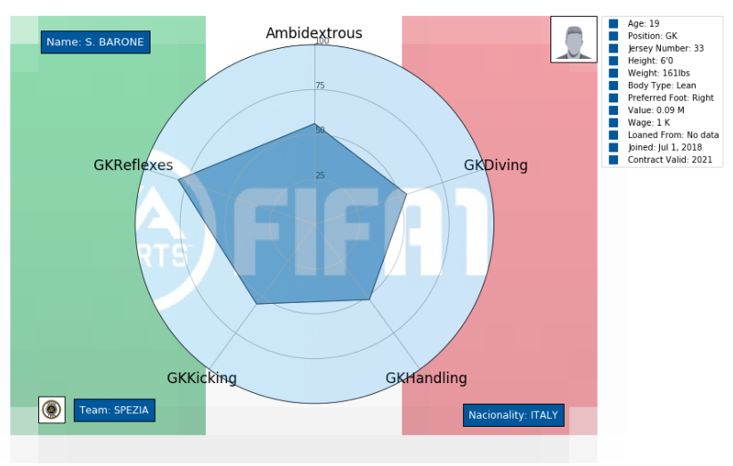

# EDA Fifa 2019 DataSet Kaggle


## ***DATASET***: [FIFA 19 complete player dataset created by Karan Gadiya](https://www.kaggle.com/karangadiya/fifa19)

## IMPORTS

```
import matplotlib
import matplotlib.pyplot as plt
import matplotlib.image as mpimg
from matplotlib.offsetbox import (OffsetImage,AnnotationBbox)
import pandas as pd
import numpy as np
from math import pi
import requests
from time import time
from datetime import datetime, timedelta
import random
```

## NEW CATEGORIES

New categories are created by joining player statistics and obtaining the average.
For example, to obtain the Interceptions of the player join the Marking, StandingTackle, SlidingTackle and HeadingAccuracy obtained a general average that transforms into the ***Defending*** column

```
def defending(players):
    return int(round((players[['Interceptions','Marking', 'StandingTackle', 'SlidingTackle', 'HeadingAccuracy']].mean()).mean()))

def passing(players):
    return int(round((players[['Vision', 'Crossing', 'ShortPassing','LongPassing','FKAccuracy','Curve']].mean()).mean()))

def dribbling(players):
    return int(round((players[['Agility', 'Balance', 'Reactions', 'BallControl', 'Dribbling']].mean()).mean()))

def shooting(players):
    return int(round((players[['Positioning', 'Finishing', 'ShotPower', 'LongShots', 'Volleys', 'Penalties']].mean()).mean()))

def pace(players):
    return int(round((players[['Acceleration', 'SprintSpeed']].mean()).mean()))

def physical(players):
    return int(round((players[['Jumping', 'Stamina', 'Strength', 'Aggression', 'Composure']].mean()).mean()))

def ambidextrous_func(players):
    return (int(players) * 10) + 50
```

## DIVISION OF CURRENT FEATURES TO GENERATE THE NEW COLUMNS

- ***Defending*** = [Interceptions, Marking, StandingTackle, SlidingTackle, HeadingAccuracy]
- ***passing*** = [Vision, Crossing, ShortPassing, LongPassing,FKAccuracy, Curve]
- ***Dribbling*** = [Agility, Balance, Reactions, BallControl, Dribbling]
- ***Shooting*** = [Positioning, Finishing, ShotPower, LongShots, Volleys, Penalties]
- ***Pace*** = [Acceleration, SprintSpeed]
- ***Physical*** = [Jumping, Stamina, Strength, Aggression,Composure]
- ***Ambidextrou*** = [ Preferred foot plus stars in bad foot]

## TYPE OF GRAPHIC

- Matplotlib Polar

The graphic contains the name of the player, his age, the team where he currently plays, the nationality, the photo, the image of the club logo, the flag of the country where he was born and the statistics that were created with the function.

To see the information just pass the id to the graphPolar function, this calls the detail function by passing everything necessary to create the graph and visualize it. This function can be put inside a loop to bring all the players that are needed.

The dataset has 17918 so you can pass an id from 0 to 17917.

## CREATION, DOWNLOAD AND VISUALIZATION OF IMAGES

When executing the function that creates the graph this will go through the variables to obtain through the url that we have passed the flag of the country where the player was born, the logo of the team where he plays and a photo of his face (***flag_image*** , ***player_image***, ***logo_image***). These images will be downloaded only once in the project folder, then they will be modified as the function is called again.


## DATA VISUALIZATION


If the chosen player is GK or not, the graph is created with different statistics

### ***No GK***


### ***GK***


### If the photo of the player's face is not obtained, a silhouette is set by default



## OTHER ANALYZES

***Wage per player***


***Players who have the most value***


***Teams with greater potential. Wage of players. Player with the highest Wage per team.***


***Nationalities by teams***


***Heat***


***MIT License***

Copyright (c) 2019 Juan Spinelli <jmspinelliok@gmail.com>

Permission is hereby granted, free of charge, to any person obtaining a copy of this software and associated documentation files (the "Software"), to deal in the Software without restriction, including without limitation the rights to use, copy, modify, merge, publish, distribute, sublicense, and/or sell copies of the Software, and to permit persons to whom the Software is furnished to do so, subject to the following conditions:

The above copyright notice and this permission notice shall be included in all copies or substantial portions of the Software.

THE SOFTWARE IS PROVIDED "AS IS", WITHOUT WARRANTY OF ANY KIND, EXPRESS OR IMPLIED, INCLUDING BUT NOT LIMITED TO THE WARRANTIES OF MERCHANTABILITY, FITNESS FOR A PARTICULAR PURPOSE AND NONINFRINGEMENT. IN NO EVENT SHALL THE AUTHORS OR COPYRIGHT HOLDERS BE LIABLE FOR ANY CLAIM, DAMAGES OR OTHER LIABILITY, WHETHER IN AN ACTION OF CONTRACT, TORT OR OTHERWISE, ARISING FROM, OUT OF OR IN CONNECTION WITH THE SOFTWARE OR THE USE OR OTHER DEALINGS IN THE SOFTWARE.

